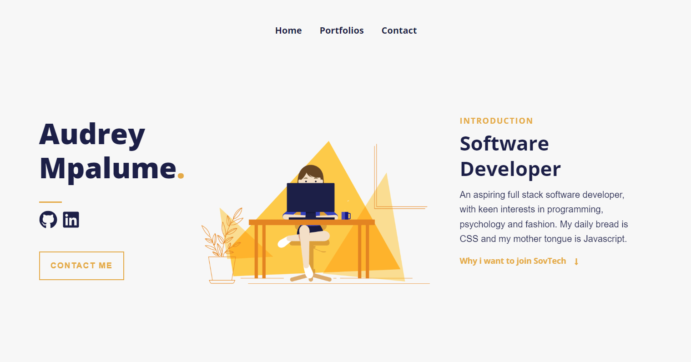
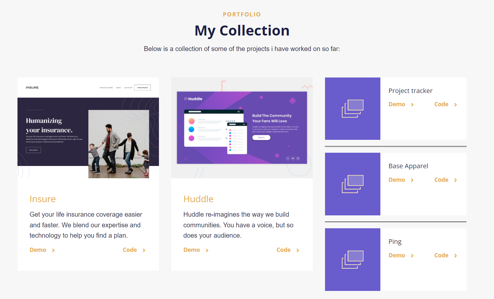

# Personal Portfolio




# Introduction

 My personal portfolio site, developed in ReactJS.
 Here's the URL of the deployed app on Netlify:
[Demo](https://rococo-brioche-dfbe0e.netlify.app/)

# Technologies Used

* React (v16.13.1)
* React Hooks
* Functional Components
* React-Bootstrap 4 (CSS Framework)
* React-icons

# How to run and setup project

To get started, follow the below steps:

1. Clone repo
2. Open root directory
3. Install packages using your preferred package manager:
 ```sh
 npm install
```
4. Run application with
```sh
 npm start
```
